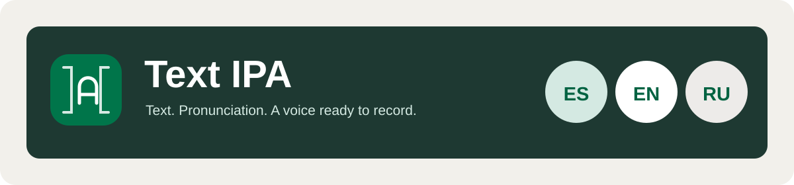
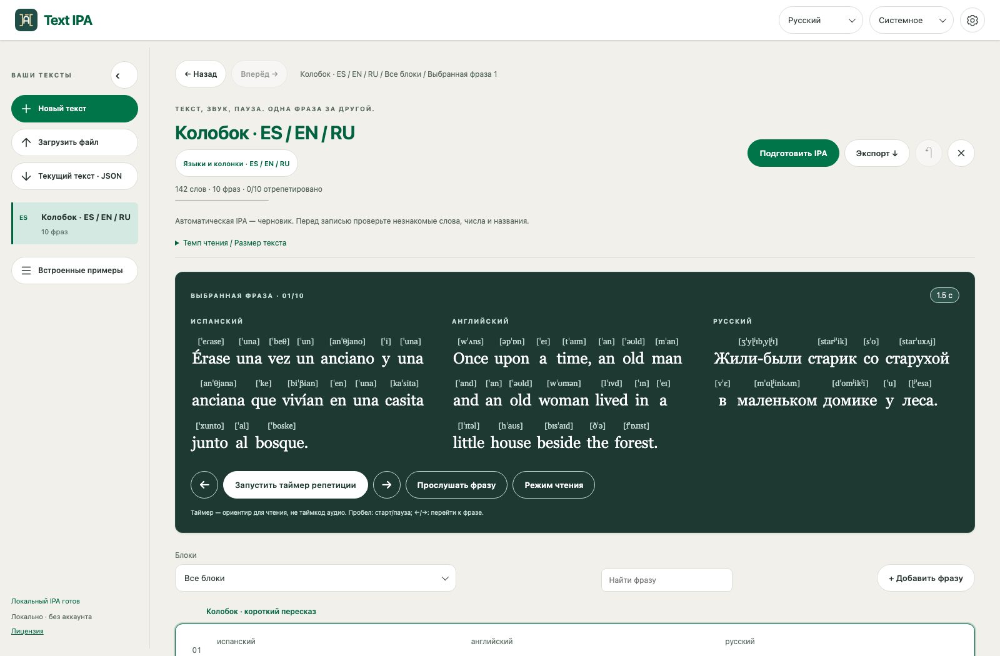
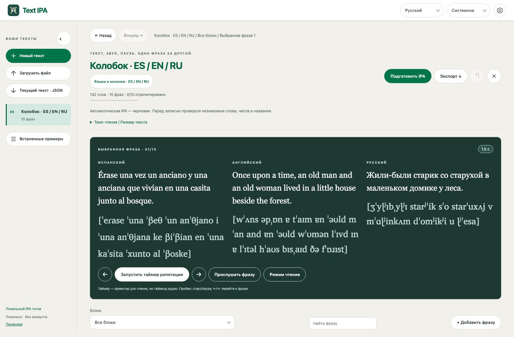

# Text IPA

[English](README.md) · [Русский](README.ru.md) · [Español](README.es.md)




Локальная мастерская для подготовки текста озвучки: языковые версии, IPA, переводы и репетиция по фразам. Вставьте текст, выберите колонки и читайте с транскрипцией над каждым словом либо отдельной строкой.



## Чтение и произношение

- Весь текст идёт непрерывным списком. Стрелки переключают фразы; пробел запускает/останавливает таймер. Прокрутка к фразе включается отдельно.
- «Языки и колонки» рядом с названием задаёт до восьми версий в одном JSON. Смена основного языка и скрытие колонок сохраняют остальные версии.
- Шестерёнка открывает настройки: **IPA над словами** или **отдельной строкой**, показ переводов, закрепление хедера и сворачивание панели. Выбор сохраняется после перезагрузки; `ipa=above` / `ipa=line` в URL воспроизводят расположение IPA.
- Автоматическая черновая IPA: испанский (Испания/seseo), английский (UK/US), русский. Для других языковых кодов доступны импорт и ручная IPA. Перед записью проверьте произношение.
- IPA над словами использует явные пары `wordIpa`, а не разрезанную строку транскрипции. Черновики слов генерируются отдельно и могут отличаться от связной речи; IPA фразы сохраняется. Без корректной разметки показывается отдельная строка.
- Локальные голоса браузера, размер текста/IPA, темп и паузы. Доступность голосов зависит от системы; платные токены не используются.
- Светлая, тёмная и системная темы, кастомные меню и подсказки, компактная панель с иконками, адаптивные колонки и reduced motion.



## Примеры и файлы

При первом запуске открывается [Колобок](examples/kolobok-es-ru.json): десять фраз на испанском, английском и русском с отдельной черновой IPA и разметкой слов. [Hello](examples/hello-multilingual.json) — короткий JSON-шаблон трёх языков; русская IPA оставлена пустой, её можно подготовить локально.

TXT/Markdown создают исходный текст. JSON сохраняет языковые версии, IPA, разметку слов, паузы и заметки. Доступны экспорт текста в JSON/TXT, выбранных колонок в Markdown и резервная копия библиотеки. Импорт создаёт редактируемую копию в браузере, исходный файл не меняется.

## Технологии

| Область       | Реализация                                                        |
| ------------- | ----------------------------------------------------------------- |
| Интерфейс     | TypeScript, семантический HTML, CSS-переменные; без React/Next.js |
| Сборка        | Vite 8.3.2, TypeScript 7.0.2                                      |
| Локальный API | Node.js 24+, middleware Vite, eSpeak NG                           |
| Шрифт IPA     | Локальный Charis 7.000, бесплатная SIL OFL 1.1                    |
| Хранение      | localStorage браузера, переносимые JSON-копии                     |
| Офлайн        | Manifest, иконки, версионированный service worker из сборки       |
| Проверки      | Node test runner, TypeScript, Prettier 3.9.9, локальный браузер   |

## Локальная разработка

Нужны **Node.js 24+**, npm и Make. Для автоматической IPA — **eSpeak NG** в PATH либо полный путь в `ESPEAK_BIN`. База данных и Docker не требуются.

```sh
make            # установить при необходимости, собрать и открыть localhost:8767
make start      # то же самое (алиасы: make s / make S)
make init       # установить зависимости без запуска
make dev        # сервер разработки
make check      # TypeScript, тесты, форматирование
make build      # production HTML, CSS, JavaScript и PWA → dist/
make format     # Prettier
```

Без Make: `npm start` или `npm run dev`. Запуск использует lockfile и проверяет прямые версии зависимостей. Повторный production-запуск пересобирает файлы и использует подходящий сервер этого проекта; чужой сервер на порту вызывает сообщение о конфликте. `PORT` меняет локальный порт, `NO_OPEN=1` отключает открытие браузера. Запуск на Windows здесь не проверен.

## Структура

- `src/types/`: контракты данных/API; `src/domain/`: валидация, импорт, языковые версии и разметка слов.
- `src/widgets/`: header, sidebar, workspace, editor, reader, footer.
- `src/features/`: настройки, примеры, фонетическая справка и озвучка.
- `src/shared/ui/`: элементы управления, кастомные dropdown, popover и tooltip.
- `src/infrastructure/`: сохранение, PWA и локальный сервер; `src/i18n/`: тексты интерфейса RU/EN/ES.
- `src/app/`: состояние приложения и навигация; `src/styles/`: тема и layout.
- `scripts/`: запуск/сборка/PWA; `tests/`: тесты; `examples/`: публичные JSON-примеры; `public/`: обложка, иконки, шрифты.

Исходный код — TypeScript. `dist/`, зависимости, диагностика и личные примеры игнорируются. Сгенерированные файлы не редактируются вручную.

## Приватность и офлайн

Тексты и настройки сохраняются в localStorage этого браузера. Для IPA выбранный текст поступает только на локальный сервер `127.0.0.1`, который запускает eSpeak NG. Аналитики, API автоматического перевода и облачной TTS нет. Перед очисткой данных сайта экспортируйте JSON. У другого профиля браузера, адреса или порта — отдельное хранилище.

После загрузки production-версии сохранённые файлы приложения и тексты работают офлайн. Новая IPA и каталог примеров требуют локального сервера. Service worker кеширует приложение, не ответы API и не личный текст; обновление активируется после закрытия окон приложения. Значки README загружаются с Shields.io и не входят в приложение.

## Примечания и лицензия

IPA — черновик, а не гарантия правильного произношения. Таймер оценивает время чтения, не длительность аудио. Распознавания и оценки произношения нет.

Прочитайте полные условия в [LICENSE](LICENSE). Этот файл имеет приоритет; README не заменяет его. Шрифт Charis распространяется по отдельной [SIL OFL](public/fonts/charis/OFL.txt).

[](LICENSE)
